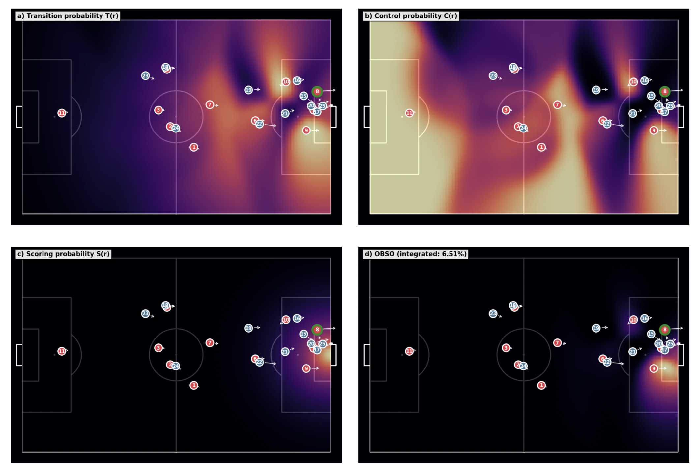

# Pitch Control & OBSO Analysis

A football analytics platform implementing Spearman's Pitch Control model and Off-Ball Scoring Opportunity (OBSO) analysis with an interactive web interface.



## Overview

This project answers: **"Which attacking positions create the most valuable scoring opportunities?"**

- **Pitch Control**: Probability field showing which team can reach each pitch location first
- **OBSO**: Combines pass transition, ball control, and scoring probability to quantify attacking threat

## Demo

**[Try it live](https://pitch-control.onrender.com/)**

Or run locally:

```bash
git clone https://github.com/donalhill/pitch-control.git
cd pitch-control
pip install -e .
python -m app.main
```

## Features

- Vectorized pitch control computation with Numba JIT acceleration
- Interactive Dash web app for browsing match events
- Pre-computed analysis for Metrica Sports sample data
- OBSO decomposition visualizations

## References

- Spearman, W. (2018). *Beyond Expected Goals*. MIT Sloan Sports Analytics Conference.
- Data: [Metrica Sports Sample Data](https://github.com/metrica-sports/sample-data)

## License

MIT
