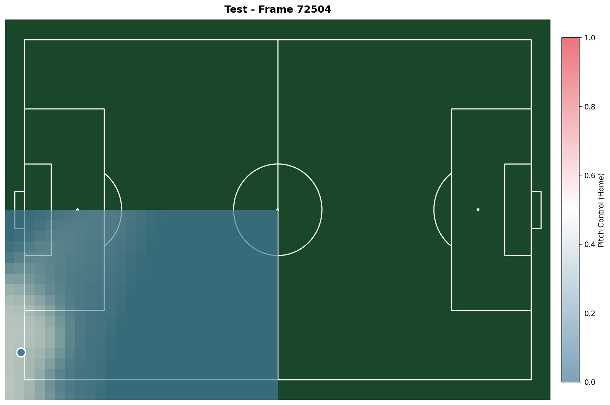

# Pitch Control & OBSO Analysis

A football analytics platform implementing Spearman's Pitch Control model and Off-Ball Scoring Opportunity (OBSO) analysis. Built with vectorized NumPy computations, Numba JIT acceleration, and an interactive Dash web interface.



## Overview

This project answers a fundamental question in football analytics: **"Which attacking positions create the most valuable scoring opportunities?"**

It combines physics-based player movement modeling with expected possession value to identify and visualize high-value off-ball positions during match events.

### Key Concepts

- **Pitch Control**: Probability field showing which team can reach each location on the pitch first, accounting for player positions, velocities, and reaction times
- **OBSO (Off-Ball Scoring Opportunity)**: Combines three factors to quantify scoring threat:
  - *Pass Transition T(r)*: Can the ball get there?
  - *Ball Control C(r)*: Can the attacking team win it there?
  - *Scoring Probability S(r)*: Can they score from there?

## Features

**Computational**
- Vectorized Spearman pitch control using NumPy broadcasting
- Numba JIT compilation for performance-critical integrations
- Ball time-of-flight modeling for realistic pass timing
- Velocity-aware time-to-intercept calculations
- Offside detection and goalkeeper advantage handling
- 0.5m grid resolution (210×136 cells covering 105m×68m pitch)
- Optional GPU acceleration via CuPy

**Interactive Web App**
- Match browser with game and team selection
- Ranked event list showing top OBSO opportunities
- Per-event OBSO decomposition visualization (2×2 grid)
- Cumulative OBSO timeline with goal markers
- Spatial distribution heatmaps with percentile contours
- Pre-rendered images for instant loading


## Installation

```bash
# Clone the repository
git clone https://github.com/donalhill/pitch-control.git
cd pitch-control

# Create virtual environment
python -m venv venv
source venv/bin/activate  # On Windows: venv\Scripts\activate

# Install dependencies
pip install -e .

# Optional: GPU support
pip install -e ".[gpu]"

# Optional: Development tools
pip install -e ".[dev]"
```

**Requirements**: Python 3.10+

## Usage

### Run the Web Application

```bash
# Development mode
python -m app.main

# Production mode
gunicorn app.main:server -b 0.0.0.0:8050
```

Then open http://localhost:8050 in your browser.

### Pre-compute Match Data

```bash
# Compute pitch control and OBSO for all events
python scripts/precompute.py --game 1

# Export lightweight version for web deployment
python scripts/export_slim.py --game 1
```

### Use as a Library

```python
from pitch_control.io.metrica import load_game
from pitch_control.models.pitch_control import compute_pitch_control
from pitch_control.models.obso import compute_obso

# Load tracking data
home, away, events = load_game(game_id=1)

# Compute pitch control for a frame
pc = compute_pitch_control(home, away, frame=72504, ball_pos=(30, 34))

# Compute OBSO surface
obso = compute_obso(home, away, frame=72504, ball_pos=(30, 34))
```

## Project Structure

```
pitch_control/
├── src/pitch_control/       # Core library
│   ├── models/              # Pitch control, OBSO, EPV models
│   ├── io/                  # Data loaders (Metrica Sports)
│   ├── viz/                 # Visualization utilities
│   └── physics/             # Physics helpers
├── app/                     # Dash web application
│   └── main.py              # Interactive match browser
├── scripts/                 # Data processing scripts
│   ├── precompute.py        # Batch computation
│   └── export_slim.py       # Web export optimization
├── data/
│   ├── metrica/             # Sample match data (auto-downloaded)
│   ├── precomputed/         # Analysis results
│   └── epv_grid.csv         # Expected Possession Value grid
└── output/                  # Generated visualizations
```

## Tech Stack

| Category | Technologies |
|----------|-------------|
| Scientific Computing | NumPy, SciPy, Numba, Pandas |
| Visualization | Matplotlib, mplsoccer, Plotly |
| Web Framework | Dash, Dash Bootstrap Components |
| Data Source | Metrica Sports Open Data |
| Deployment | Gunicorn, Render.com |

## Model Parameters

Based on Spearman (2018) Table 1:

| Parameter | Value | Description |
|-----------|-------|-------------|
| λ (lambda) | 3.99 Hz | Control rate |
| κ (kappa) | 1.72 | Defensive advantage |
| s | 0.54 s | Reaction time |
| v_max | 5.0 m/s | Maximum player speed |

## Data Source

This project uses the [Metrica Sports Sample Data](https://github.com/metrica-sports/sample-data), which provides open tracking data for research and development purposes.

## References

- Spearman, W. (2018). *Beyond Expected Goals*. MIT Sloan Sports Analytics Conference.
- Fernández, J., Bornn, L., & Cervone, D. (2021). *A framework for the fine-grained evaluation of the instantaneous expected value of soccer possessions*. Machine Learning, 110(6), 1389-1427.

## License

MIT
